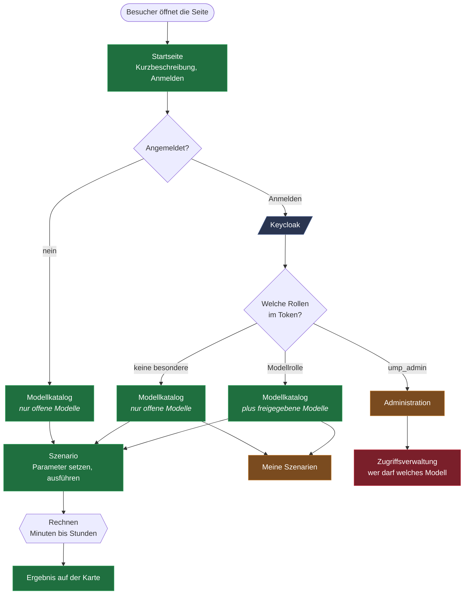
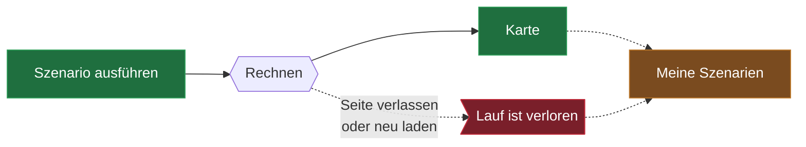
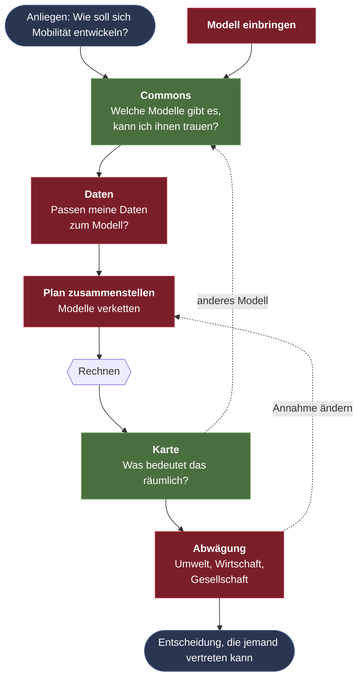
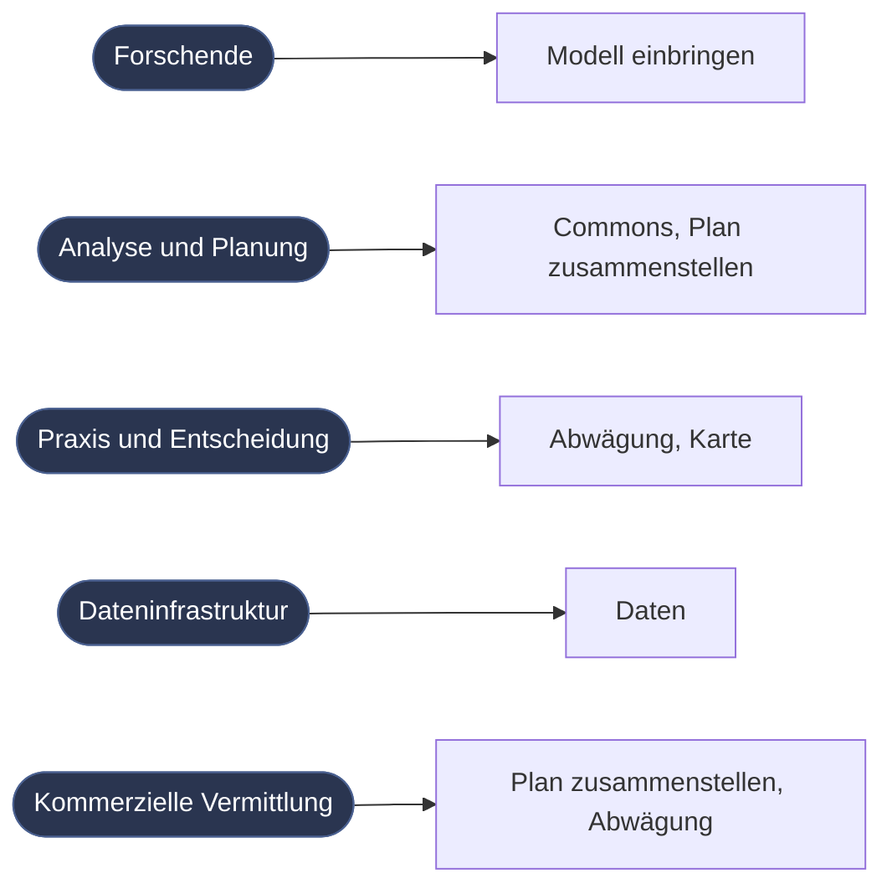

# Ablauf im Frontend

Welche Wege ein Nutzer durch UMP-X nehmen kann, abhängig von Anmeldung und
Rechten, und was davon gebaut ist.

Englische Fassung: `frontend-flow.md`.

Farben in allen Diagrammen:

- **grün** gebaut und in Betrieb
- **orange** Platzhalter, Seite existiert mit „coming soon"
- **rot** noch nicht vorhanden, aus dem Workshop-Zielbild

## Der Einstieg entscheidet alles

Der Katalog ist dreimal derselbe Bildschirm, er zeigt nur unterschiedlich viel.
Ohne Anmeldung erscheinen die Modelle mit `anonymous-access: true`, mit
passender Rolle kommen die übrigen dazu.

## Wer darf was

| | ohne Anmeldung | angemeldet | mit Modellrolle | ump_admin |
|---|---|---|---|---|
| Startseite | ja | ja | ja | ja |
| Offene Modelle sehen und ausführen | ja | ja | ja | ja |
| Geschützte Modelle | nein | nein | ja | ja |
| Meine Szenarien | nein | ja | ja | ja |
| Administration | nein | nein | nein | ja |

Zwei verschiedene Rollenarten steuern das:

**Modellzugriff** über Rollen am `ump-client`, benannt nach dem Modellserver:
`<modelserver>` für alle seine Prozesse, `<modelserver>_<prozess>` für einen
einzelnen. Welcher Prozess offen ist, steht dagegen nicht in Keycloak, sondern
in der `providers.yaml` des Backends als `anonymous-access`.

**Administration** über die Realm-Rolle `ump_admin`.

Durchgesetzt wird das im Frontend je Seite über `definePageMeta`, nicht global.
Was der Nutzer im Katalog sieht, entscheidet ohnehin das Backend.

## Was heute fehlt

Der Ablauf endet beim Start des Laufs. Es gibt keinen Fortschritt, keine
Übersicht, kein Wiederfinden. Bei Laufzeiten von Minuten bis Stunden ist das
die auffälligste Lücke, und sie wird größer, sobald Modelle verkettet werden.

Zu entscheiden ist dabei weniger, wie eine Liste aussieht, sondern was in der
Wartezeit passiert: Bleibt jemand auf der Seite? Kommt er später wieder und wird
benachrichtigt? Woran erkennt er einen fehlgeschlagenen Lauf?

## Wohin es gehen soll

Aus dem Workshop, sechs Komponenten. Der heutige Stand deckt Teile von zweien
ab, der Rest fehlt vollständig.

Heller grün heißt: in Ansätzen vorhanden. Der Modellkatalog ist noch kein
Commons, er listet nur auf, was konfiguriert ist. Vertrauen, Herkunft,
Wiederverwendung fehlen. Die Karte zeigt GeoJSON-Ergebnisse, aber nicht
notwendigerweise so, dass sie jemanden überzeugt.

Wichtig an diesem Diagramm sind die gestrichelten Rückwege. Das ist kein
Formular, das man einmal durchläuft: Wer abwägt, ändert Annahmen und rechnet
neu, wer die Karte sieht, merkt dass ein Modell fehlt.

## Nicht alle starten am selben Punkt

Aus dem Persona-Check. Das spricht gegen einen Assistenten, der alle durch
dieselbe Reihenfolge schickt.

Heute gibt es genau einen Einstieg für alle, nämlich die Startseite mit dem
Modellkatalog dahinter.

## Verwandtes

- `neues-modell-hinzufuegen.md`, welche Stellen ein neues Modell technisch berührt
- `runbook-growbike-als-modellserver.md`, Modellserver und Rollen
- `deployment.md`, Branch-Kette und Umgebungen
