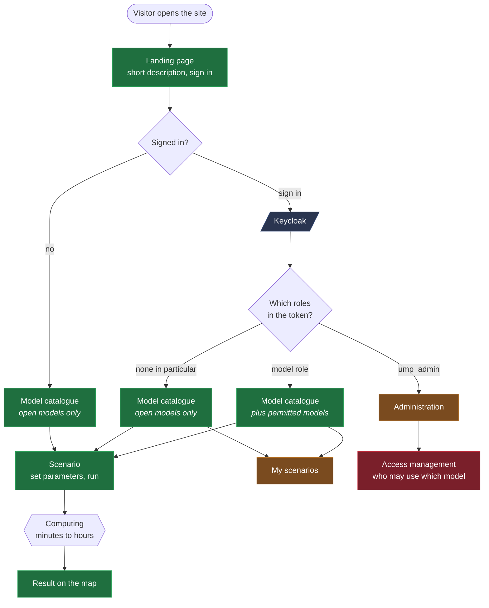
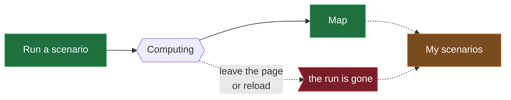
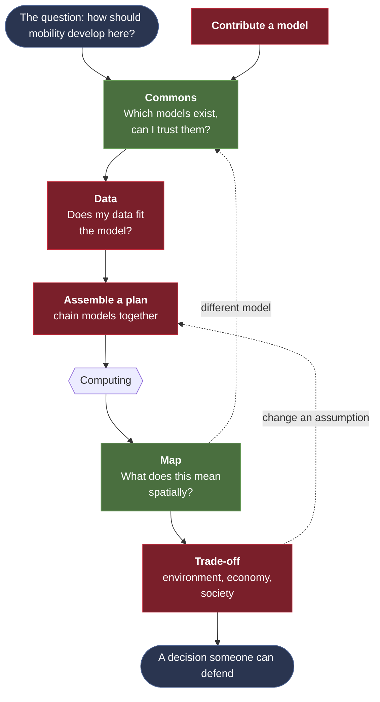
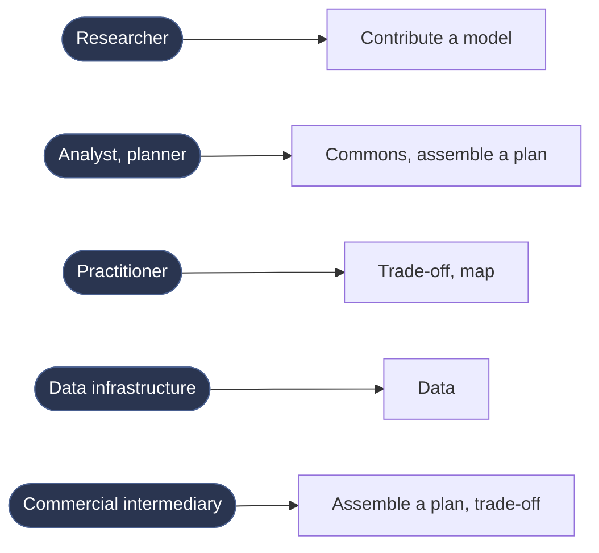

# Frontend flow

Which paths a user can take through UMP-X, depending on sign-in and roles, and
how much of it is built.

German version: `ablauf-frontend.md`.

Colours throughout:

- **green** built and running
- **orange** placeholder, the page exists with "coming soon"
- **red** not there yet, from the workshop target picture

## The entry point decides everything

The catalogue is the same screen three times, it just shows different amounts.
Without signing in you see the models marked `anonymous-access: true`, with a
matching role the rest appears as well.

## Who may do what

| | signed out | signed in | with model role | ump_admin |
|---|---|---|---|---|
| Landing page | yes | yes | yes | yes |
| See and run open models | yes | yes | yes | yes |
| Restricted models | no | no | yes | yes |
| My scenarios | no | yes | yes | yes |
| Administration | no | no | no | yes |

Two different kinds of role govern this:

**Model access** through roles on `ump-client`, named after the model server:
`<modelserver>` for all its processes, `<modelserver>_<process>` for a single
one. Which process is open, however, is not decided in Keycloak but in the
backend's `providers.yaml` via `anonymous-access`.

**Administration** through the realm role `ump_admin`.

The frontend enforces this per page via `definePageMeta`, not globally. What
ends up in the catalogue is decided by the backend anyway.

## What is missing today

The flow ends the moment a run is started. There is no progress, no overview,
no way back to it. With runtimes of minutes to hours that is the most visible
hole, and it grows once models are chained.

What needs deciding is less how a list looks and more what happens during the
wait: does someone stay on the page, come back later and get notified, and how
do they recognise a failed run?

## Where this is meant to go

From the workshop, six components. Today's state covers parts of two, the rest
is absent.

Lighter green means partly there. The model catalogue is not a Commons yet, it
lists what has been configured, without trust, provenance or reuse. The map
renders GeoJSON results, but not necessarily in a way that convinces anyone.

The dashed arrows matter. This is not a form you fill in once: whoever weighs
trade-offs changes assumptions and recomputes, whoever sees the map notices a
model is missing.

## Not everyone starts at the same place

From the persona check. This argues against a wizard that sends everyone
through the same order.

Today there is exactly one entry point for everyone, the landing page with the
model catalogue behind it.

## Related

- `neues-modell-hinzufuegen.md`, which places a new model touches technically
- `runbook-growbike-als-modellserver.md`, model servers and roles
- `deployment.md`, branch chain and environments
