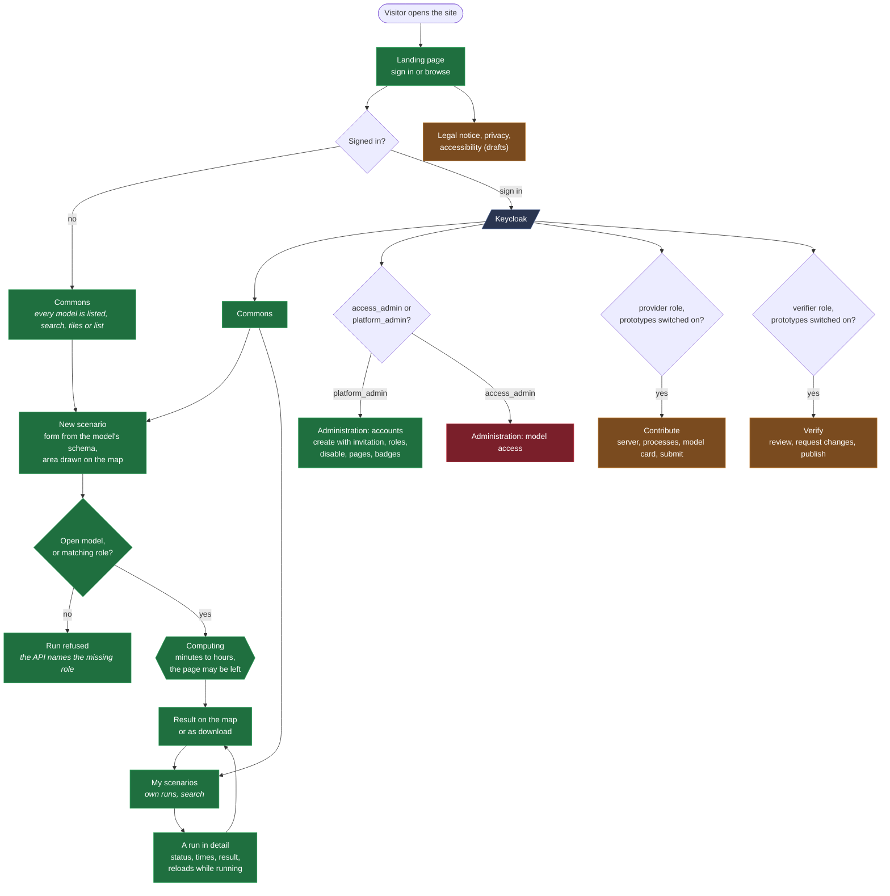
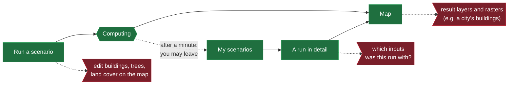
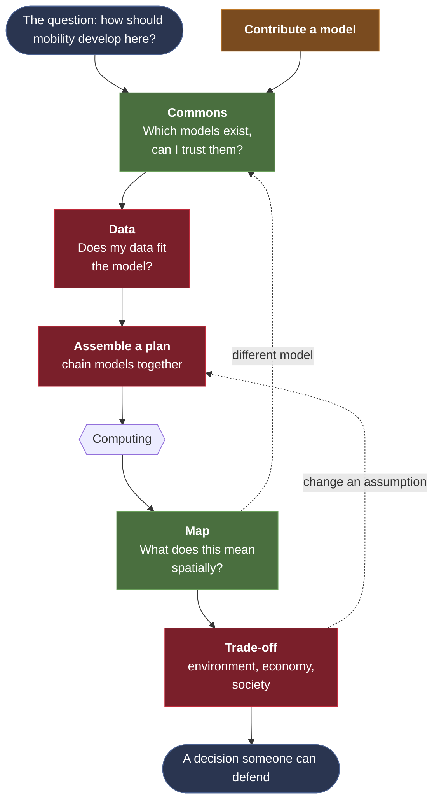
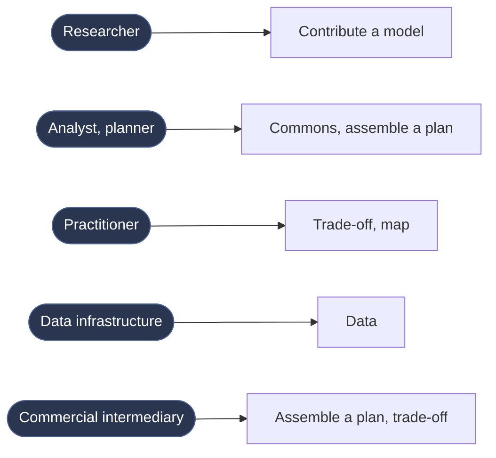

# Frontend flow

Which paths a user can take through UMP-X, depending on sign-in and roles, and
how much of it is built.

**As of 2026-10-07**, checked against the code (`93c5033`, staging) and against
the running staging backend. Anyone changing a route, a middleware or a state updates
this document with it. See "Keeping this current" at the end.

Colours throughout:

- **green** built and running
- **orange** prototype with sample data, or placeholder
- **red** not there yet

## The entry point decides everything

```mermaid
flowchart TD
    Start([Visitor opens the site])
    Start --> Landing["Landing page<br/>sign in or browse"]

    Landing --> Q{Signed in?}

    Q -->|no| Anon["Commons<br/><i>every model is listed, search, tiles or list</i>"]
    Q -->|sign in| KC[/"Keycloak"/]

    KC --> Signed["Commons"]

    Anon --> Run
    Signed --> Run

    Run["New scenario<br/>form from the model's schema,<br/>area drawn on the map"]
    Run --> Allowed{"Open model,<br/>or matching role?"}
    Allowed -->|no| Denied["Run refused<br/><i>the API names the missing role</i>"]
    Allowed -->|yes| Wait{{"Computing<br/>minutes to hours,<br/>the page may be left"}}
    Wait --> Map["Result on the map<br/>or as download"]

    Signed --> Mine
    Map --> Mine
    Mine["My scenarios<br/><i>own runs, search</i>"]
    Mine --> Detail["A run in detail<br/>status, times, result,<br/>reloads while running"]
    Detail --> Map

    KC --> AdminQ{"access_admin or<br/>platform_admin?"}
    AdminQ -->|platform_admin| Accounts["Administration: accounts<br/>create with invitation, roles,<br/>disable, pages, badges"]
    AdminQ -->|access_admin| Access["Administration: model access"]

    KC --> Prov{"provider role,<br/>prototypes switched on?"}
    Prov -->|yes| Contribute["Contribute<br/>server, processes, model card, submit"]
    KC --> Ver{"verifier role,<br/>prototypes switched on?"}
    Ver -->|yes| Verify["Verify<br/>review, request changes, publish"]

    Landing --> Legal["Legal notice, privacy,<br/>accessibility (drafts)"]

    classDef built fill:#1f6f3f,stroke:#2ea05a,color:#fff
    classDef placeholder fill:#7a4b1f,stroke:#c07a2a,color:#fff
    classDef missing fill:#7a1f2a,stroke:#c02a3a,color:#fff
    classDef external fill:#2a3550,stroke:#4a6090,color:#fff

    class Landing,Anon,Signed,Run,Allowed,Denied,Wait,Map,Mine,Detail,Accounts built
    class Contribute,Verify,Legal placeholder
    class Access missing
    class KC external
```

Seeing and running are separate since UMP 3.0.0: the catalogue is open to everyone,
the run is not. You find out where you stand when you press the button, which is why
the refusal has to say what is missing rather than only that something failed.

## Who may do what

| | signed out | signed in (viewer, user, provider) | with model role | verifier | access_admin | platform_admin |
|---|---|---|---|---|---|---|
| Landing page, Commons, help, legal pages | yes | yes | yes | yes | yes | yes |
| Run an open model | yes | yes | yes | yes | yes | yes |
| Run a restricted model | no | no | yes | no | no | no |
| My scenarios | no | yes | yes | yes | yes | yes |
| Contribute (prototype) | no | yes, as provider | | | | |
| Verify (prototype) | no | no | no | yes | no | no |
| Administration: accounts and platform roles | no | no | no | no | no | yes |
| Administration: model access | no | no | no | no | planned | no |

Three kinds of role govern this, all from Keycloak:

**Platform roles**, realm roles named `user_role_…`: `viewer`, `user` and `provider`
come with the realm's default role, so every new account has them; `verifier`,
`access_admin` and `platform_admin` are assigned. Platform admins assign them in the
administration, and can also take a default role away from a single account.

**Running a model** through a client role on `ump-client` named exactly like the
process it unlocks: `<provider>` for every process of that model server,
`<provider>:<process>` for a single one (for example `umep-modelserver`). A process
marked `anonymous-access: true` in the backend's `providers.yaml` needs no role at all.
Refused, the API names the role it looked for. These roles are created by hand in the
Keycloak console until the model registry exists.

**Administration** through `user_role_access_admin` or `user_role_platform_admin`. The
page shows the sections per role; the server checks the role again in every route.

Whether the catalogue itself is filtered is a server setting, `UMP_PUBLIC_PROCESSES`.
On staging it is on, so the list shows everything to everyone and only the run is
gated.

The frontend enforces sign-in and roles per page via `definePageMeta` (`auth`,
`admin`, `provider`, `verifier`, and `prototype` for pages behind
`NUXT_PUBLIC_PROTOTYPES`). Who may run what is decided by the backend; the frontend
only has to explain it.

## What is missing today

```mermaid
flowchart LR
    Run["Run a scenario"] --> W{{"Computing"}}
    W --> M["Map"]
    W -.->|after a minute:<br/>you may leave| S["My scenarios"]
    S --> D["A run in detail"]
    D --> M
    D -.-> I>"which inputs<br/>was this run with?"]
    M -.-> L>"result layers and rasters<br/>(e.g. a city's buildings)"]
    Run -.-> E>"edit buildings, trees,<br/>land cover on the map"]

    classDef built fill:#1f6f3f,stroke:#2ea05a,color:#fff
    classDef gap fill:#7a1f2a,stroke:#c02a3a,color:#fff
    class Run,W,M,S,D built
    class I,L,E gap
```

**Waiting is solved since 2026-10-05.** The form follows a run without a time limit,
says after a minute that the page can be left, and the run page reloads an unfinished
run by itself. What still ends a long run is the backend: UMP stops waiting for a model
server after its configured time (`ttw-job-done`), and a run that depends on external
data such as Overpass can fail there.

What is still missing:

- **The inputs of a run.** UMP stores them but does not return them, so a run cannot
  be traced or repeated with the same values. Needs `GET /jobs/{id}/definition`.
- **Result layers and rasters.** A result that is a set of layers or a raster cannot
  be shown yet; it needs links to data the browser can read.
- **Editing the status quo.** Feature collections with attributes (buildings, trees,
  land cover) have no map editor yet; they need the model server's hints to reach the
  frontend through UMP.
- **The refusal is still the API's sentence**, for example "Missing role
  'umep-modelserver' or 'umep-modelserver:prepare-city'.", English and phrased for
  whoever administers Keycloak. It should say that the model is not released for you,
  and who releases it.

One quirk belongs here: **the API recognises identical requests** and returns the same
run, possibly with its earlier failure. Starting the same scenario again therefore
creates no second run. The detail page says so, otherwise the button looks stuck.

## Where this is meant to go

From the workshop, six components. Today's state covers parts of two, the rest
is absent.

```mermaid
flowchart TD
    Question([The question: how should mobility develop here?])

    Question --> Commons
    Commons["<b>Commons</b><br/>Which models exist,<br/>can I trust them?"]
    Data["<b>Data</b><br/>Does my data fit<br/>the model?"]
    Build["<b>Assemble a plan</b><br/>chain models together"]
    Compute{{Computing}}
    Map["<b>Map</b><br/>What does this mean<br/>spatially?"]
    Weigh["<b>Trade-off</b><br/>environment, economy,<br/>society"]
    Done([A decision someone can defend])

    Commons --> Data --> Build --> Compute --> Map --> Weigh --> Done
    Weigh -.->|change an assumption| Build
    Map -.->|different model| Commons

    Contribute["<b>Contribute a model</b>"] --> Commons

    classDef partial fill:#4a6f3f,stroke:#6aa05a,color:#fff
    classDef prototype fill:#7a4b1f,stroke:#c07a2a,color:#fff
    classDef missing fill:#7a1f2a,stroke:#c02a3a,color:#fff
    classDef endpoint fill:#2a3550,stroke:#4a6090,color:#fff
    class Commons,Map partial
    class Contribute prototype
    class Data,Build,Weigh missing
    class Done,Question endpoint
```

Lighter green means partly there. The model catalogue is not a Commons yet: it lists
what has been configured, without a model card, provenance or reuse. Contributing and
reviewing exist as a prototype with sample data, following the planned model registry.
The map renders GeoJSON results in the colours a model sends along, but no layers or
rasters yet.

The dashed arrows matter. This is not a form you fill in once: whoever weighs
trade-offs changes assumptions and recomputes, whoever sees the map notices a
model is missing.

## Not everyone starts at the same place

From the persona check. This argues against a wizard that sends everyone
through the same order.

```mermaid
flowchart LR
    R([Researcher]) --> R1["Contribute a model"]
    A([Analyst, planner]) --> A1["Commons, assemble a plan"]
    P([Practitioner]) --> P1["Trade-off, map"]
    D([Data infrastructure]) --> D1["Data"]
    C([Commercial intermediary]) --> C1["Assemble a plan, trade-off"]

    classDef persona fill:#2a3550,stroke:#4a6090,color:#fff
    class R,A,P,D,C persona
```

Today there is one entry point for everyone, the landing page with Commons behind it.
Providers and verifiers additionally see Contribute and Verify when prototypes are
switched on. The sidebar shows Projects, Data repository and Report greyed out
(Contribute too, while prototypes are off): visible so the direction is legible,
disabled so nobody clicks into nothing.

## Keeping this current

This document goes stale faster than anything else in the folder, because it
describes states rather than procedures. It is only useful if it can be
believed.

Update it as soon as any of these changes:

- a route appears or disappears (`app/pages/`)
- a page moves between placeholder and built
- a middleware changes, that is, who may go where (`definePageMeta`)
- a path between two pages appears or disappears
- the backend changes who may see or run what. This one is easy to miss because
  nothing in our repository moves. UMP 3.0.0 pulled seeing and running apart on
  2026-08-31 and this document claimed the old rule until someone measured.

When updating, check the colours against the code rather than from memory:
green means built and running, orange means prototype or placeholder, red means not
there, then set the date at the top. This document is kept in
English only: a second language version drifted out of sync faster than it
helped.

## Related

- `add-new-model-de.md`, which places a new model touches technically
- `runbook-growbike-modelserver-de.md`, model servers and roles
- `deployment-de.md`, branch chain and environments, including the prototype switch
- `privacy-inventory-en.md`, which personal data the paths touch
